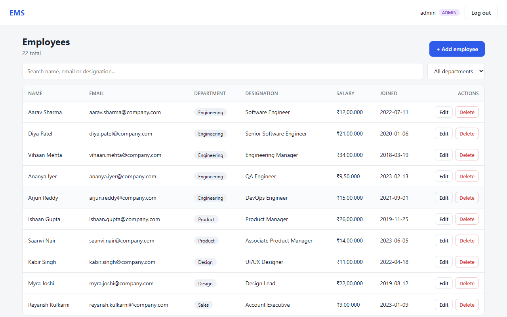
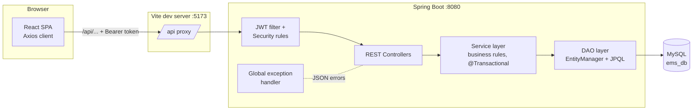
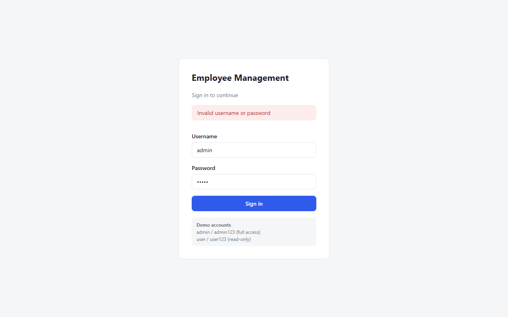
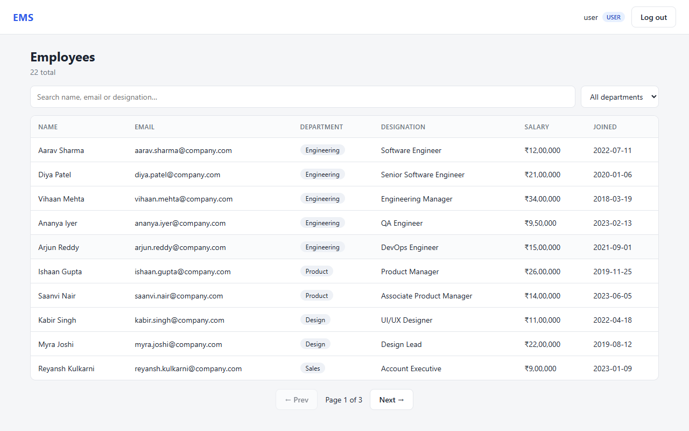
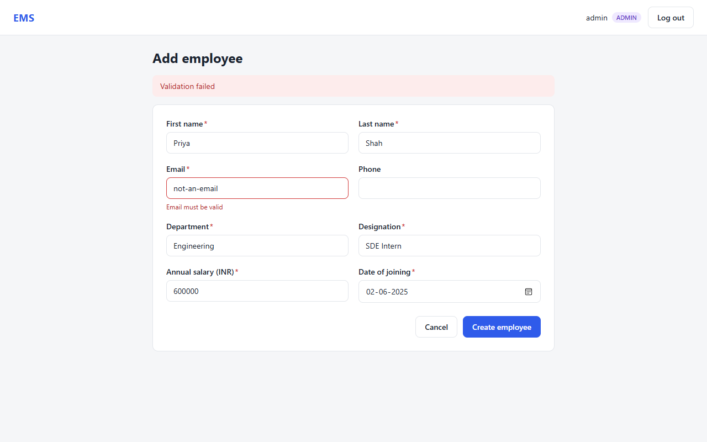
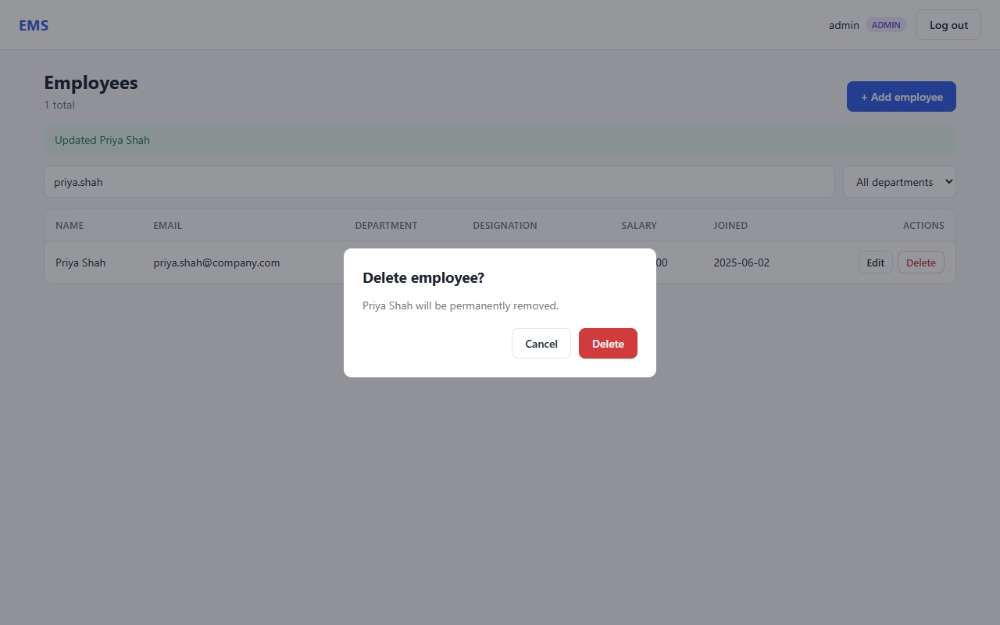

# Employee Management System

A full-stack employee management application: a **Spring Boot REST API** with a layered
Controller → Service → DAO architecture on **MySQL**, secured with **JWT and role-based access**,
and a **React** frontend that talks to it through **Axios**.



## Features

- **Employee CRUD**: create, view, update and delete employee records
- **Search, filter, sort, paginate**: keyword search (name / email / designation), department filter,
  sortable columns, server-side pagination
- **Authentication**: login issues a signed JWT; every API call is verified statelessly
- **Role-based authorization**: `ADMIN` has full access, `USER` is read-only (enforced on the server;
  the UI also hides actions the user can't perform)
- **Validation and consistent errors**: Bean Validation on every input, one JSON error shape for
  400 / 401 / 403 / 404 / 409 / 500, with per-field messages shown inline in the form
- **Business rules**: unique email per employee (case-insensitive), no future joining dates, positive salary
- **Tested**: 21 automated tests: service unit tests, web-layer security tests, and full end-to-end API tests

## Tech Stack

| Layer    | Technology                                                             |
|----------|------------------------------------------------------------------------|
| Backend  | Java 21, Spring Boot 3.5, Spring Web, Spring Data JPA (Hibernate), Bean Validation |
| Security | Spring Security 6, JWT (jjwt), BCrypt password hashing                  |
| Database | MySQL 8 (H2 in-memory for tests)                                       |
| Frontend | React 19, React Router 7, Axios, Vite 7                                 |
| Testing  | JUnit 5, Mockito, MockMvc, spring-security-test                        |

## Architecture



Each layer has one job:

| Layer | Responsibility | Key classes |
|-------|----------------|-------------|
| **Controller** | HTTP only: routes, status codes, `@Valid` input, DTOs in/out | `EmployeeController`, `AuthController` |
| **Service** | Business logic: uniqueness rules, normalisation, not-found handling, transaction boundaries | `EmployeeServiceImpl`, `AuthService` |
| **DAO** | Database access through JPA `EntityManager` with parameterised JPQL | `EmployeeDaoImpl`, `UserDaoImpl` |
| **Cross-cutting** | Security filter chain, JWT, CORS, global error handling | `SecurityConfig`, `JwtAuthenticationFilter`, `GlobalExceptionHandler` |

Controllers never touch the database, and the service depends on the `EmployeeDao` *interface*, so
each layer can be tested in isolation and the persistence technology could change without touching
business logic.

### Request lifecycle (e.g. `PUT /api/employees/7`)

1. Axios attaches `Authorization: Bearer <jwt>`; the Vite proxy forwards `/api` to port 8080.
2. `JwtAuthenticationFilter` verifies the signature and expiry, loads the user and sets the `SecurityContext`.
3. Spring Security checks the rule: non-GET on `/api/employees/**` requires `ROLE_ADMIN`, otherwise **403**.
4. `EmployeeController` validates the body (`@Valid`); failures become **400** with field errors.
5. `EmployeeServiceImpl` (in a transaction) loads the employee (**404** if missing), rejects an email
   owned by someone else (**409**), applies the changes.
6. `EmployeeDaoImpl` merges and flushes through the `EntityManager`; Hibernate issues the `UPDATE`.
7. The entity is mapped to an `EmployeeResponse` DTO and returned as JSON.

## API Reference

All endpoints are under `/api`. Everything except login needs `Authorization: Bearer <token>`.

| Method | Endpoint | Role | Description |
|--------|----------|------|-------------|
| `POST` | `/auth/login` | public | Returns a JWT for valid credentials |
| `GET` | `/auth/me` | any | Current username and role |
| `GET` | `/employees` | USER, ADMIN | Paged list. Query: `search`, `department`, `page` (0-based), `size` (1-100), `sortBy`, `direction` (`asc`/`desc`) |
| `GET` | `/employees/{id}` | USER, ADMIN | One employee |
| `GET` | `/employees/departments` | USER, ADMIN | Distinct departments (for filters) |
| `POST` | `/employees` | ADMIN | Create; returns **201** and a `Location` header |
| `PUT` | `/employees/{id}` | ADMIN | Update |
| `DELETE` | `/employees/{id}` | ADMIN | Delete; returns **204** |

<details>
<summary>Example requests and responses</summary>

```bash
# Login
curl -X POST localhost:8080/api/auth/login -H "Content-Type: application/json" \
     -d '{"username":"admin","password":"admin123"}'
# {"token":"eyJhbGciOi...","tokenType":"Bearer","expiresInMs":3600000,"username":"admin","role":"ADMIN"}

# Search, sorted by salary (highest first)
curl "localhost:8080/api/employees?search=engineer&sortBy=salary&direction=desc&size=5" \
     -H "Authorization: Bearer $TOKEN"
# {"content":[...],"page":0,"size":5,"totalElements":8,"totalPages":2}

# Validation error
# {"status":400,"error":"Bad Request","message":"Validation failed",
#  "fieldErrors":{"email":"Email must be valid","salary":"Salary must be positive"}, ...}
```
</details>

## Getting Started

### Prerequisites
- Java 21+ (Maven is bundled through the wrapper, so you don't need to install it)
- Node.js 20.19+
- MySQL 8

### 1. Database
```sql
CREATE DATABASE ems_db;
CREATE USER 'ems_user'@'localhost' IDENTIFIED BY 'ems_pass_2025';
GRANT ALL PRIVILEGES ON ems_db.* TO 'ems_user'@'localhost';
```
Tables are created automatically by Hibernate on first start.

### 2. Backend
```bash
cd backend
./mvnw spring-boot:run          # Windows: mvnw.cmd spring-boot:run
```
Runs on `http://localhost:8080`. On first start it seeds two demo accounts and 22 sample employees.

| Username | Password | Role |
|----------|----------|------|
| `admin` | `admin123` | ADMIN (full access) |
| `user` | `user123` | USER (read-only) |

### 3. Frontend
```bash
cd frontend
npm install
npm run dev
```
Open `http://localhost:5173`.

### Configuration
Every setting has a local default and can be overridden with environment variables:

| Variable | Default | Purpose |
|----------|---------|---------|
| `DB_URL` | `jdbc:mysql://localhost:3306/ems_db...` | JDBC URL |
| `DB_USERNAME` / `DB_PASSWORD` | `ems_user` / `ems_pass_2025` | DB credentials |
| `JWT_SECRET` | dev-only key | Base64 HMAC key, **must be overridden in production** |
| `JWT_EXPIRATION_MS` | `3600000` (1 h) | Token lifetime |
| `CORS_ALLOWED_ORIGINS` | `http://localhost:5173` | Origins allowed to call the API directly |
| `SEED_ENABLED` | `true` | Create demo users and sample data |

## Testing

```bash
cd backend
./mvnw test
```

| Suite | Type | What it covers |
|-------|------|----------------|
| `EmployeeServiceImplTest` | Unit (Mockito) | Business rules with the DAO mocked: duplicates, not-found, email normalisation, paging maths |
| `EmployeeControllerTest` | Web slice (`@WebMvcTest`) | HTTP status codes, validation errors, **401 / 403 role rules** |
| `EmployeeApiIntegrationTest` | End-to-end (`@SpringBootTest` + H2) | Real login, full CRUD through every layer, forged-token rejection, sort-field whitelist |

## Design Decisions

- **Explicit DAO layer over Spring Data repositories.** Writing the JPQL by hand with the
  `EntityManager` keeps the query logic visible (dynamic filters, pagination, count queries).
  Spring Data would cut the boilerplate. The service only depends on the `EmployeeDao` interface,
  so switching later would be a one-class change.
- **DTOs instead of exposing entities.** The API contract is independent of the table schema,
  clients can't set fields like `id` or `createdAt`, and there are no lazy-loading surprises during serialisation.
- **Stateless JWT instead of server sessions.** No session storage, so the API scales horizontally.
  The filter reloads the user on each request so a deleted account stops working immediately.
  The trade-off is that a token can't be revoked before it expires, so expiry is kept short.
- **Sort-field whitelist.** JPQL can't bind column names as parameters, so `sortBy` is checked
  against an allow-list before it reaches the query string. Every *value* goes through bound parameters.
- **Vite dev proxy for CORS.** In development the browser only talks to `localhost:5173`, and the proxy
  forwards `/api` to Spring Boot, so the browser never makes a cross-origin call. The backend still has
  an explicit CORS allow-list for deployments where the frontend is served from another origin.
- **Authorization enforced on the server.** The React route guards and hidden buttons are only there
  for a better UI. Every rule is enforced again by Spring Security on each request.

## Project Structure

```
employee-management-system/
├── backend/
│   └── src/main/java/com/ems/
│       ├── controller/     # REST endpoints (HTTP only)
│       ├── service/        # Business logic + transactions
│       ├── dao/            # EntityManager-based data access
│       ├── entity/         # JPA entities (Employee, User, Role)
│       ├── dto/            # Request/response records
│       ├── security/       # JWT service, filter, user details, 401/403 handler
│       ├── exception/      # Custom exceptions + global handler
│       └── config/         # Security/CORS config, seed data
└── frontend/
    └── src/
        ├── api/            # Axios instance (interceptors) + API functions
        ├── context/        # Auth state
        ├── components/     # Navbar, route guard, confirm dialog
        └── pages/          # Login, employee list, add/edit form
```

## Screenshots

| Login | Read-only USER view |
|-------|---------------------|
|  |  |

| Server-side validation | Delete confirmation |
|------------------------|---------------------|
|  |  |

## Possible Improvements

- Flyway migrations instead of `ddl-auto=update`
- Refresh tokens and token revocation
- OpenAPI/Swagger documentation
- Docker Compose for one-command setup (MySQL + API + frontend)
- Audit log of who changed what
